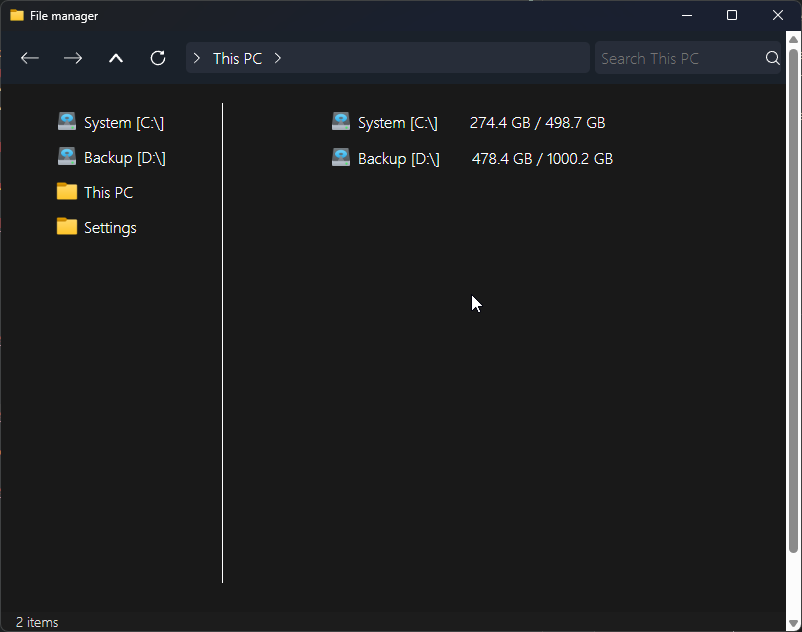
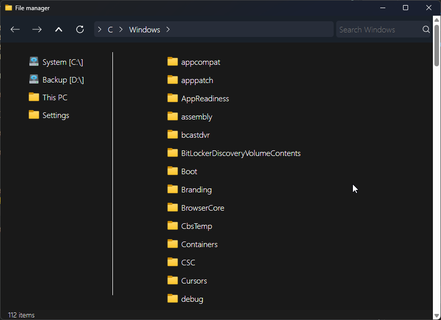
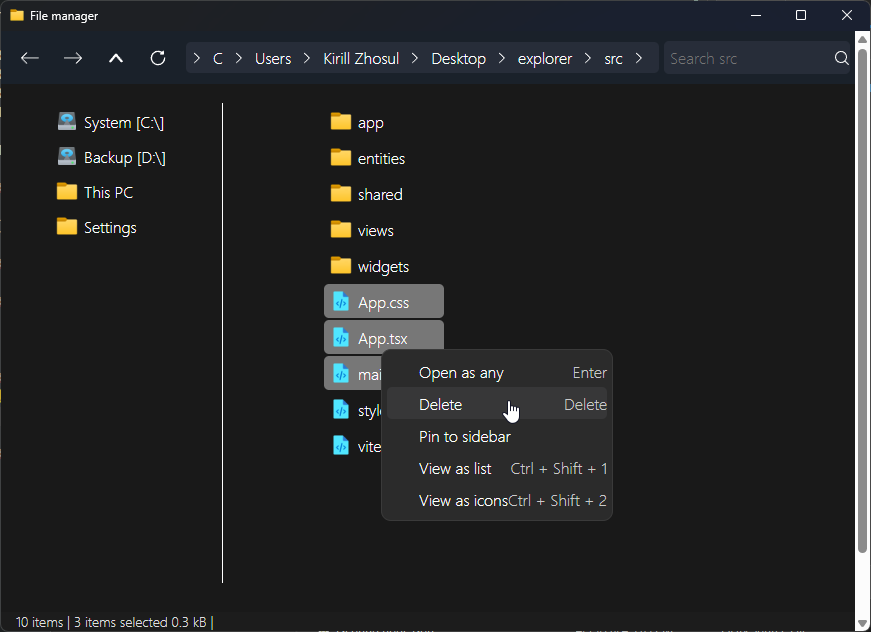

# Explorer

Simple file explorer in style of Windows 11 built with Tauri

### Features

- Home (View disk drives)
- Files view (view files)
- Sidebar (WIP), bookmarks
- History and navigation (WIP)
- Selection (WIP), select multiple items and deal with them
- Context menu (WIP), select what to do with selected file / current directory

### TODO

- Improve layout and design, as at some point it lose style
- Improve context menu, add new features
- Improve selection, allow to immediately RMB to open selected context menu, allow to shift-select
- Improve sidebar
- Fix history navigation
- Add column information (like, Windows explorer)
- Much more

### Built stack

The project is built using Tauri (React + Rust)

Rust is used for backend OS interactions for now
React is capable of rendering (frontend), storing settings, and actually deal with raw data from Rust backend

For now there is mess in the source code, main goal is to build maintainable code

### How to build / run

[Read that](docs/readme/HOW_TO_BUILD.md)

### Preview

#### Home page

#### Some files

#### Selection and context menu (with no selection)

